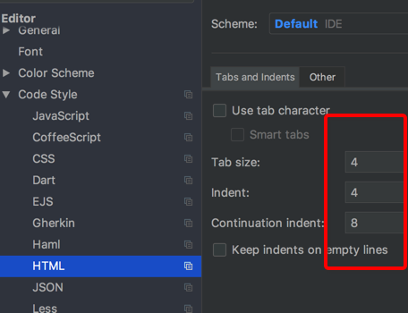

## 安装


### node 安装
请根据不同系统下载不同的node 包， [node下载地址](http://nodejs.cn/download/)，推荐版本10+。在命令行中确认是否安装完成，正确显示版本即可

```shell
node -v
```


### mrnpm 安装


```shell
npm install -g mrnpm --registry http://registry.npm.mr.com
```

:::tip
`mac`下可能需要在命令行前添加 `sudo`
:::


### git 安装

MAC可以使用第三方包管理器 HomeBrew

```shell
/usr/bin/ruby -e "$(curl -fsSL https://raw.githubusercontent.com/Homebrew/install/master/install)"
```

开始安装git

```shell
brew install git
```

Linux 可以用自带的yum

```shell
yum install git
```

[window-git下载地址](https://git-scm.com/)


### IDE准备

WebStorm or Intellij IDEA 

- 安装vue.js 

    File -> Settings -> Plugins -> Browse respositoties...
    搜索vue.js，右侧提示Install（截图时已安装，未安装会提示Install）。安装成功后需要重启IDEA。
    
- 设置代码
    
    
